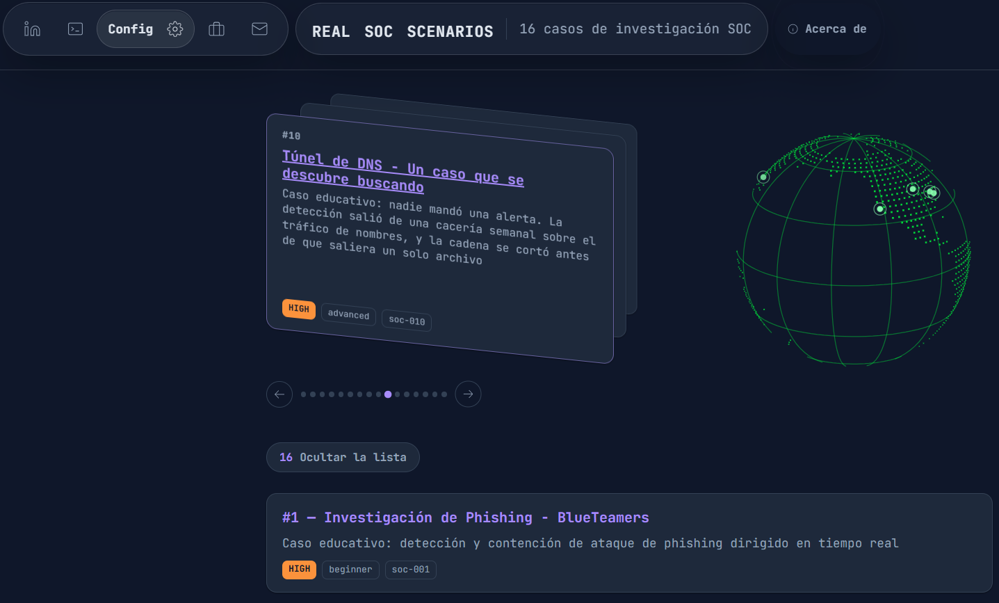
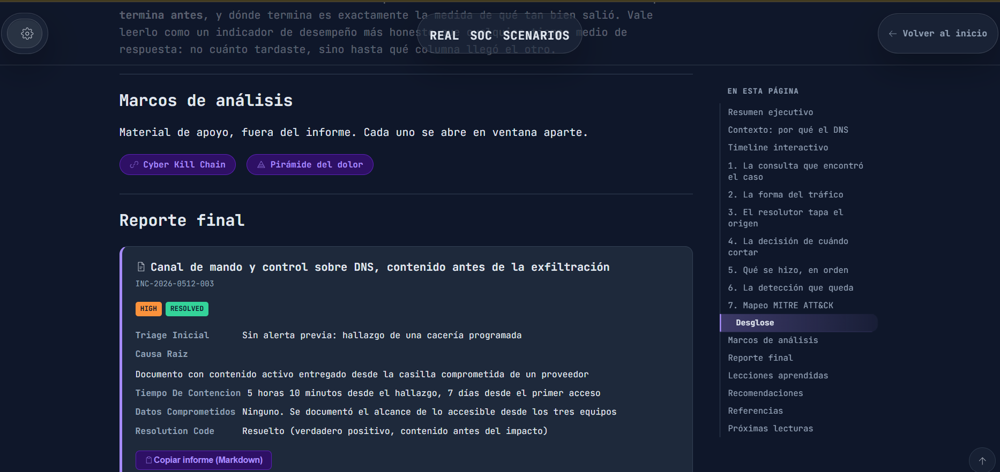

# Real SOC Scenarios

**Live:** <https://real-soc-scenarios.javiermapelli.workers.dev> | English version: [README.en.md](README.en.md)

> Qué disparó la alerta · Qué miró el analista · Por qué llegó a esa conclusión

---

## ¿Qué es este proyecto?

Casos de investigación en un SOC, documentados paso a paso. El objetivo no es
catalogar amenazas —para eso ya está MITRE— sino mostrar el razonamiento
completo: qué decía la alerta, qué se verificó, contra qué fuente, qué quedó sin
verificar, y por qué el analista llegó a esa conclusión y no a otra.

Cada caso combina la narrativa con componentes interactivos — línea de tiempo del
incidente, tabla de indicadores, mapeo a MITRE ATT&CK y la ficha de cierre — para
que se pueda seguir el razonamiento y no solo el resultado.

Sitio estático y bilingüe, con una página por idioma resuelta en build desde la
ruta.

## Estado actual

Veinte casos, completos en español e inglés. Cada idioma tiene su propia ruta
y su propio archivo de contenido.

| | |
| --- | --- |
| Casos | 20, del `soc-001` al `soc-020` |
| Idiomas | Español e inglés, con paridad verificada |
| Páginas generadas | 43 |
| Dificultad | De `beginner` a `expert` |
| Marcos usados | ATT&CK Enterprise, ICS y Mobile; OWASP para API y para modelos de lenguaje |

Once de los casos reconstruyen incidentes documentados públicamente. Los otros
nueve son escenarios construidos para el ejercicio, y lo declaran en su primera
pantalla.

---

## Capturas

Portada: mazo de casos y globo con la geografía de los incidentes reales.



Página de caso: marcos de análisis, ficha de cierre e índice lateral con
seguimiento del scroll.



---

## Fuentes y criterio

Los casos reales se arman a partir de material público: avisos de agencias,
informes de equipos de investigación, publicaciones de fabricantes y documentos
oficiales. Cada escenario indica su fuente en el frontmatter y enlaza las
técnicas al catálogo de MITRE ATT&CK.

Los indicadores se publican defangueados y no se incluye infraestructura de
ningún entorno real. Los escenarios sintéticos usan los rangos y dominios que las
RFC 5737, 2606 y 5398 reservan para documentación, así que nada de lo que aparece
puede resolverse.

Cuando dos fuentes buenas discrepan sobre un dato, el caso anota la discrepancia
en lugar de elegir en silencio. Cuando un dato no está verificado contra fuente
primaria, el caso lo dice.

---

## Stack

- Astro 7 con MDX para el contenido y Preact para los componentes interactivos
- Colecciones de contenido tipadas con Zod (`src/content.config.ts`)
- Sistema de temas y tipografías por custom properties — ver [THEMES.md](THEMES.md)
- Sitio estático, sin backend

---

## Estructura

```text
src/
├── components/
│   ├── soc/               Componentes de caso (timeline, indicadores, ATT&CK, reporte, marcos)
│   ├── mdx/               Marcas en línea que se inyectan al contenido
│   ├── SiteHeader.jsx     Encabezado: configuración, enlaces, marca y volver
│   ├── AboutModal.jsx     Acerca de, en ventana, desde el encabezado del inicio
│   ├── CopyEmailButton.jsx  Contacto: copia la dirección y avisa
│   ├── CookieConsent.jsx  Aviso de cookies y puerta de la analítica
│   ├── CaseDeck.jsx       Mazo de casos del inicio
│   ├── Globe.jsx          Globo con la geografía de los casos
│   └── TableOfContents.jsx  Índice lateral con seguimiento del scroll
├── config/                Catálogo de temas, fuentes e idiomas
├── content/scenarios/
│   ├── es/                Un .mdx por caso
│   └── en/                Su equivalente en inglés
├── data/                  Máscara de tierra firme del globo (generada)
├── i18n/                  Diccionario de interfaz y helpers de ruta
├── layouts/               Layout base
├── pages/                 Raíz de reparto y rutas /[lang]/
├── styles/                Temas y estilos de cada pieza
└── utils/                 Construcción de URL con base

scripts/                   Verificaciones que corren sobre dist/
tools/                     Verificaciones y generadores que corren sobre el código
```

---

## Comandos

| Comando                 | Acción                                                          |
| ----------------------- | --------------------------------------------------------------- |
| `npm install`           | Instala dependencias                                            |
| `npm run dev`           | Servidor de desarrollo en `localhost:4321`                       |
| `npm run build`         | Genera el sitio en `./dist/`                                    |
| `npm run preview`       | Sirve el build local antes de desplegar                         |
| `npm run check`         | Catálogo, defangueo, idioma, contraste del globo y estilo       |
| `npm run check:catalogo`| Coherencia entre archivos de caso, sobre los `.mdx`             |
| `npm run check:idioma`  | Secciones escritas en el idioma equivocado                      |
| `npm run audit:i18n`    | Cobertura de traducción de la interfaz, sobre el código         |

**`npm run build` va siempre antes de `npm run check`.** Dos de los cinco
verificadores de la cadena leen `dist/` —el de defangueo y el de idioma—, así que
sin compilar primero revisan el contenido de la vez anterior y pasan en verde
igual. `check:catalogo` lee los `.mdx` y por eso corre primero: es el que puede
dar un veredicto útil incluso sin build.

---

## Agregar un caso

1. El archivo va en `src/content/scenarios/es/NN-nombre-del-caso.mdx`. El
   directorio define el idioma y el nombre define la URL.
2. El frontmatter sigue el esquema de `src/content.config.ts`. El prefijo
   numérico tiene que coincidir con `caseNumber`, y `caseId` se deriva de ese
   número como `soc-0NN`. El campo `locations` es opcional y coloca marcadores en
   el globo del inicio.
3. Los componentes se importan desde `@/components/soc/`.
4. La ruta se genera sola en `/es/scenarios/<nombre-del-archivo>/`.

Los componentes se renderizan estáticos por defecto. Para habilitar filtros,
botones y demás interacción llevan `client:load`.

**Cada componente interactivo recibe `lang` con el idioma de su archivo.** Sin ese
atributo, la interfaz de ese componente sale en el idioma por defecto dentro de
una página del otro.

La versión en inglés se escribe al final, cuando el caso en español está
investigado, cargado y revisado en el navegador. Traducir sobre contenido que
todavía puede cambiar obliga a corregir dos veces.

---

## Marcos de análisis

Además de los componentes del informe, hay tres marcos que se abren en ventana
aparte desde un botón. Son material de apoyo opcional: no todos los casos llevan
uno, y varios no llevan ninguno.

El criterio: **si no hay datos reales para llenarlo, no va.** Un marco a medio
completar enseña menos que su ausencia, y la ausencia se explica dentro del caso.

| Marco            | Se incluye cuando…                                                                                   |
| ---------------- | ---------------------------------------------------------------------------------------------------- |
| `PyramidOfPain`  | El caso tiene indicadores en varios escalones, o la lección es *por qué* falló la detección por firma |
| `DiamondModel`   | Hay datos en los cuatro vértices: adversario identificado, capacidad, infraestructura y víctima       |
| `KillChain`      | Se puede señalar en qué eslabón se cortó la cadena, o por qué no se cortó en ninguno                  |

Los tres requieren `client:load`: sin hidratar, el botón no abre nada.

Tres casos no usan ninguno de los tres, y en cada uno el motivo está escrito: dos
se describen mejor con las listas de OWASP, porque hay que hablarle a quien
escribe la aplicación, y el otro no tuvo adversario.

---

## Convenciones de contenido

Las marcas en línea `<Pass />`, `<Fail />` y `<Warn />` están disponibles en
cualquier `.mdx` sin importarlas. Se usan cuando el contraste forma parte del
argumento — tres hipótesis donde dos no cierran, lo que un control detecta frente
a lo que no. Una lista donde todos los renglones llevan la misma marca no está
usando la marca para nada.

La iconografía sale de `src/components/Icon.jsx`.

Lo que un analista copiaría a una consola o a un buscador queda igual en los dos
idiomas: comandos, direcciones IP, hashes, identificadores de MITRE, nombres de
familia de malware, reglas de detección y códigos de protocolo.

---

## Despliegue

El sitio se publica en Cloudflare Workers, desde la raíz del dominio. La
configuración está en `wrangler.jsonc`.

Dos variables de entorno gobiernan la salida, y `astro.config.mjs` las lee con
valores por defecto para desarrollo local:

- **`BASE_PATH`** — el prefijo de las rutas. En Cloudflare va sin definir, porque
  el sitio vive en la raíz. Existe para que el mismo commit pueda servirse desde
  un subdirectorio sin tocar el contenido.
- **`SITE_URL`** — la URL absoluta que usan las etiquetas para compartir y los
  `hreflang`. Sin esa variable, la imagen de la tarjeta no se emite: es preferible
  que no haya imagen a que haya una que apunte a una dirección que no existe.

Ningún enlace interno se escribe a mano: todos pasan por `withBase()`, que es lo
que hace que las dos formas funcionen sin tocar el contenido.

---

## Contacto y privacidad de la dirección

El botón de contacto del encabezado **no abre el cliente de correo**: copia la
dirección al portapapeles y lo avisa. Abrir el cliente es una acción con efecto
—una ventana nueva, a veces una aplicación que tarda— y quien solo quería la
dirección termina cerrando cosas. Quien sí quiera escribir tiene el botón en el
aviso.

La dirección no viaja en claro: se arma en tiempo de ejecución desde sus partes,
así que el patrón `algo@algo.tld` no existe en el HTML ni en el texto de los
archivos JavaScript hasta que alguien hace clic. No es criptografía y no
pretende serlo. Contra un recolector que ejecute el código no sirve; contra los
que raspan texto, sí.

Si el portapapeles no está disponible —sin contexto seguro, sin permiso— el
aviso muestra la dirección para copiarla a mano en vez de fallar en silencio.

---

## Seguridad

Ver [`SECURITY.md`](SECURITY.md) para cómo reportar un problema. Importante: los
casos no son reglas de detección listas para producción. Las consultas y los
criterios que aparecen son un punto de partida educativo y necesitan calibrarse
contra el entorno real antes de usarse, cosa que cada caso dice en su propia
sección de detección.

## Uso responsable

Este proyecto tiene fines educativos y defensivos. Los casos describen técnicas
de ataque para explicar cómo se detecta cada una, no para reproducirlas.

El material no incluye código explotable ni infraestructura utilizable. Las
reconstrucciones de incidentes reales se basan en fuentes públicas ya divulgadas,
y los escenarios construidos usan direcciones y dominios reservados por RFC que no
pueden resolverse.

Las técnicas descritas no deben aplicarse sobre infraestructura ajena, sistemas
sin autorización ni entornos productivos.

---

## Contribuir

Ver [`CONTRIBUTING.md`](CONTRIBUTING.md) para las convenciones del proyecto —las nueve
invariantes, el orden de verificación, la anatomía de un caso— y cómo proponer
cambios. Este proyecto sigue un [Código de Conducta](CODE_OF_CONDUCT.md).

Lo que más valor tiene es una corrección de contenido: un dato mal citado, una
fuente que no dice lo que el caso le atribuye, o un desacuerdo con alguna de las
lecturas.

---

## Licencia

El código está bajo licencia MIT — ver [LICENSE](LICENSE).

El contenido de los casos está bajo Creative Commons Atribución 4.0 Internacional
— ver [LICENSE-CONTENT](LICENSE-CONTENT).

Son dos licencias porque el repositorio es dos cosas: software y material
escrito, y no se licencian igual. El material citado de terceros conserva la
licencia de su autor.

El registro de cambios está en [CHANGELOG.md](CHANGELOG.md).
